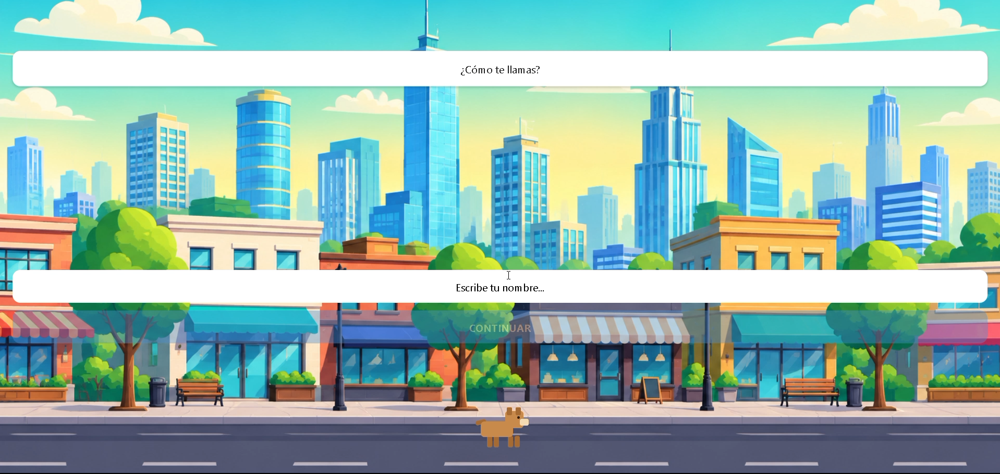

# 🎮 Aprendiendo y Jugando

> Learn English through a gamified, story-driven mobile experience.
> Aprende inglés a través de una experiencia móvil gamificada, tipo aventura.


---

## 📱 Sobre el proyecto / About

**ES:** Una app móvil para aprender inglés con un enfoque gamificado. El onboarding simula una pequeña escena de videojuego 2D: un personaje entra caminando a la ciudad, te pregunta tu nombre con un efecto de texto tipo "máquina de escribir", y te acompaña en la aventura de aprender inglés.

**EN:** A mobile app for learning English with a gamified approach. The onboarding simulates a small 2D game scene: a character walks into the city, asks for your name with a typewriter text effect, and joins you on the adventure of learning English.

---

## 🖼️ Preview



---

## ✨ Características / Features

- 🚶 **Onboarding animado** — personaje que camina, saluda y se despide con animaciones personalizadas (`Animated API`)
- ⌨️ **Diálogos estilo videojuego** — texto que se escribe letra por letra
- 🧠 **Estado global con Context API** — el nombre del usuario se comparte entre pantallas sin prop-drilling
- 💾 **Persistencia con AsyncStorage** — la app recuerda al usuario y salta el onboarding en próximas visitas
- 🗂️ **Arquitectura por features** — cada módulo (`onboarding`, próximamente `lessons`, `progress`) tiene su propia carpeta con componentes, pantallas y lógica

---

## 🛠️ Stack técnico / Tech stack

| Parte | Tecnología |
|---|---|
| App móvil | React Native + Expo |
| Lenguaje | TypeScript |
| Navegación | Expo Router |
| Estado global | React Context API |
| Persistencia | AsyncStorage |
| Backend *(próximamente)* | Python + FastAPI |
| Base de datos *(próximamente)* | PostgreSQL |

---


## 📂 Estructura del proyecto / Project structure

```
mobile/
└── src/
    ├── app/                  # Rutas (Expo Router)
    │   ├── index.tsx         # Punto de entrada — decide onboarding o Home
    │   └── main/             # Pantallas principales (tabs)
    ├── context/              # Estado global (UserContext)
    └── features/
        └── onboarding/
            ├── assets/       # Imágenes del onboarding
            ├── components/   # Character, DialogueBox, NameInput, SceneBackground
            └── screens/      # WelcomeScreen
```

---

---

## 🚀 Cómo correrlo / Getting started

```bash
# Clona el repositorio
git clone https://github.com/abram06/english-learning-app.git

# Entra a la carpeta del proyecto móvil
cd english-learning-app/mobile

# Instala las dependencias
npm install

# Inicia el servidor de desarrollo
npx expo start
```

Luego presiona `w` para abrirlo en el navegador, o escanea el QR con la app **Expo Go** en tu teléfono.

---

## 🧩 Decisiones técnicas / Technical decisions

- **Expo Router sobre React Navigation manual** — permite enrutamiento basado en archivos, similar a Next.js, reduciendo configuración inicial.
- **Context API en vez de Redux** — para el alcance actual del proyecto (un solo valor global: el usuario), Context es suficiente y evita overhead innecesario.
- **Animaciones con la API nativa `Animated`** — en vez de librerías externas, para entender a fondo cómo funcionan las animaciones antes de migrar a algo como Reanimated o Rive.
- **Arquitectura por features** — cada funcionalidad (onboarding, y las que vienen) es autocontenida, facilitando escalar el proyecto sin que los módulos se mezclen entre sí.

---

## 🗺️ Roadmap

- [x] Onboarding animado con personaje, diálogos y captura de nombre
- [x] Persistencia de sesión con AsyncStorage
- [ ] Backend con FastAPI + PostgreSQL
- [ ] Sistema de lecciones y progreso
- [ ] Autenticación de usuarios
- [ ] Integración de IA para práctica conversacional

---

## 👤 Autor / Author

**Abram** — construyendo este proyecto como parte de mi aprendizaje en desarrollo móvil.

Si trabajas en una empresa relacionada con desarrollo mobile / React Native y te interesa el proyecto, o tienes feedback, ¡hablemos! 🙌